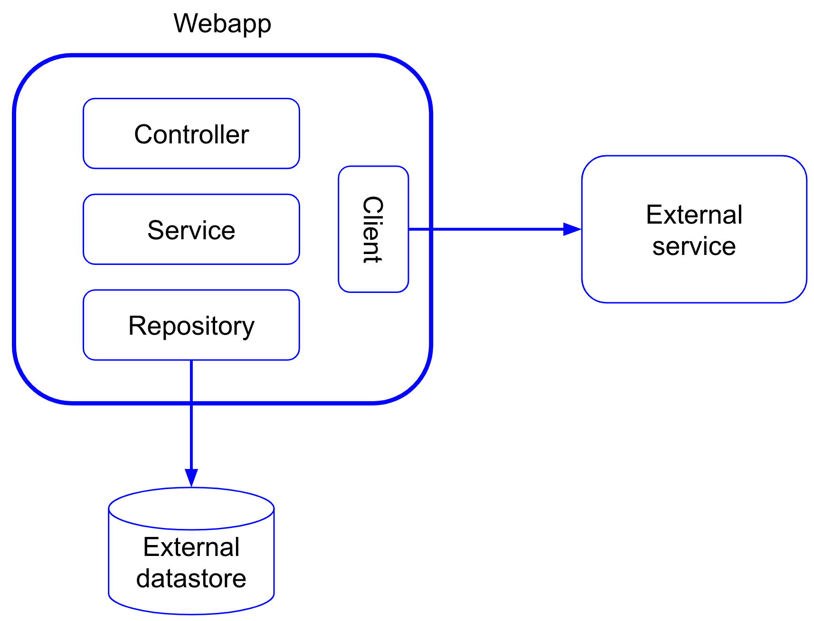

# testing-webapp

Testing of a web application. This is a Dockerized app with the following services:

- app: The web application
- mysql: A MySQL database

In addition, this app makes an HTTP call to an external service.

## Installation
**Network**

In order to be able for our test web application inside the container to access another web application on the host machine, we have to attach an IP alias to your host network interface.
 
This works for Docker for Mac 17.05 and below (For other operating systems, check [this link](https://stackoverflow.com/a/31328031/1900288)):

`sudo ifconfig lo0 alias 123.123.123.123/24`

This is the IP being used by the HospitalClient in the testing webapp in order to connect to the external service. If you use another IP, you will have to also change the HospitalClient class.

**External service**

Pull the image from DockerHub:

`docker pull xpadro/simple-web:latest`

Run the application on port 8081:

`docker run -it -p 8081:8080 xpadro/simple-web`

****

**Web app**

Clone this repository and from the root folder, build it with docker compose:

`docker-compose build`

Run it:

`docker-compose run`

## Execution

`http://localhost:8080/cities`